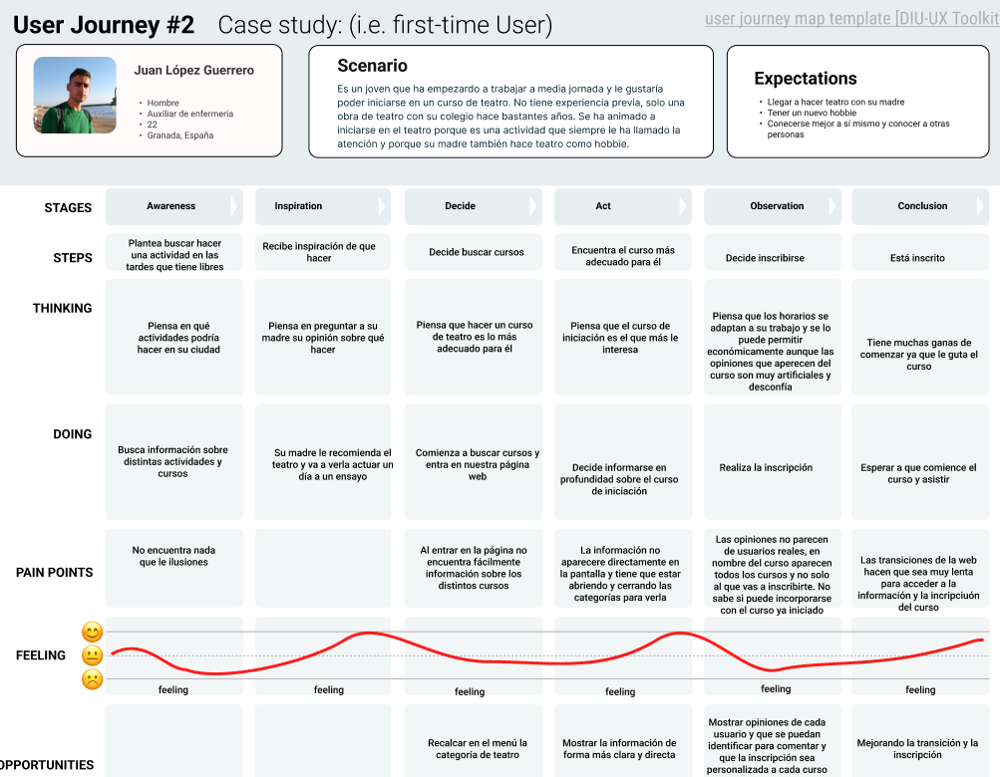
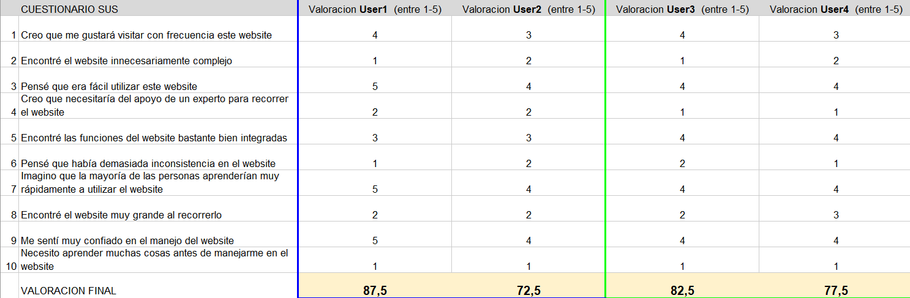

# DIU24
Prácticas Diseño Interfaces de Usuario 2023-24 (Tema: .... ) 

Grupo: DIU1_01AABB.  Curso: 2023/24 
Updated: 9/04/2024
Enlace Github: https://github.com/DIU1-loqueteapetezca/DIU

Proyecto: 

Organización de Torneos de Juegos de Mesa

Descripción: 

La idea es crear una organización donde se creen torneos de juegos de mesa tanto para nuevos jugadores y experimentados, con el fín de acercar a mas gente al mundo de los juegos de mesa

Logotipo: 

Miembros
 * :bust_in_silhouette:   Carlos Izquierdo Guzmán     :octocat:     
 * :bust_in_silhouette:  Oliver Megias Puertas     :octocat:

# Proceso de Diseño 

## Paso 1. UX User & Desk Research & Analisis 

 **1.a User Reseach Plan**
-----

>>> Buscar clases de locuión e interpretación para aprender y buscar reseñas del sitio para evaluar los cursos a tomar

Hemos escogido la web de [Escuela de teatro y doblaje remiendo](https://escueladeteatroengranada.es/) para el desarrollo de esta práctica. En este apartado hemos realizado un [User Research](P1/P1%20User%20Research.pdf) en el que nos hemos puesto en la piel de un usuario para recopilar la información.

 1.b Competitive Analysis
-----

Hemos escogido la web de [Escuela de teatro y doblaje remiendo](https://escueladeteatroengranada.es/) . Hemos escogido esta página ya que no estamos faliriarizados con el teatro y doblaje, como webs de la competencia hemos escogido la [Escuela de arte dramático de Almería](https://artedramaticoalmeria.com/) y [La bobina](https://www.labobina.es/es/) ya que ambas se dedican a lo mismo.

 1.c Persona
-----

>>> Comenta brevemente porqué has seleccionado a esas personas y sube una captura de pantalla de su ficha

Hemos escogido a Teresa y Juan ya que ambos son de edades distintas y su motivación para entrar en la página web son distintas lo que puede ayudarnos a ver de varios puntos de vista la página.

 1.d User Journey Map
----

>>> Comenta brevemente porqué has escogido estas dos experiencias de usuario (y si consideras que son habituales)

Ambas experiencias nos sirven para observar el como se puede mejorar la página web ya que ambos tienen habitos de personas de su edad como compaginarlo con el trabajo o olvidarse por estár en otra cosa.

 1.e Usability Review
----

Archivo con la nota: https://github.com/DIU1-loqueteapetezca/DIU/blob/master/P1/Revision%20de%20usabiliadd.xls

La nota final nos da un 53, aunque hay puntos que no hemos podido del todo comprobar relacionados con la compra de cursos ya que no hemos comprado ninguno, esta nota es bastante baja, lo que nos dice que esta página tiene varios puntos donde mejorar.
Por último, también tenemos un documento en el que hacemos un [briefing final](P1/Briefing.pdf)

## Paso 2. UX Design  

 2.a Reframing / IDEACION: Feedback Capture Grid / EMpathy map 
----

 2.b ScopeCanvas
----

 2.b User Flow (task) analysis 
-----

 2.c IA: Sitemap + Labelling 
----

 2.d Wireframes
-----

## Paso 3. Mi UX-Case Study (diseño)

 3.a Moodboard
-----

  3.b Landing Page
----

 3.c Guidelines
----

>>> Estudio de Guidelines y Patrones IU a usar 
>>> Tras documentarse, muestre las deciones tomadas sobre Patrones IU a usar para la fase siguiente de prototipado.

Hemos decidido implementar los Patrones IU de Resitrar, para poder iniciar sesión y realizar la inscripción en los torneos. Hemos usado la Organización de Contenidos para separarlos por categorías y Mostrar.

  3.d Mockup
----

 3.e ¿My UX-Case Study?
-----

>>> Publicar my Case Study en Github..
>>> Documente y resuma el diseño de su producto
Nuestro producto es una página que se encarga de organizar torneos. Lo hace publicando torneos y permitiendo que los usuarios de la página se puedan incribir.
Además, consta de una clasificación en la que cada usuario está dentro de un ranking según los puntos qu ha conseguido en los torneos que ha participado.
En nustra página encuentras variedad de torneos y la información relacionada con cada torneo.

## Paso 5. Exportación & evaluación con Eye Tracking 

Exportación a HTML/Flutter
-----

)  5.b Eye Tracking method 

>>> Indica cómo diseñas experimento y reclutas usuarios (uso de gazerecorder.com)  

Diseño del experimento 
----

(https://github.com/Alexrp02/DIU)

>> Uso de imágenes (preferentemente) -> hay que esablecer una duración de visualización y  
>> fijar las áreas de interes (AoI) antes del diseño. Planificar qué tarea debe hacer el usuario (buscar, comprar...) 

  
>> cambiar img por tu diseño de experimento  

>> Recordar que gazerecorder es una versión de pruebas: usar sólo con 3 usuarios para generar mapa de calor (recordar que crédito > 0 para que funcione) 

Resultados y valoración 
-----

>> Cambiar por tus resultados
  

## Paso 4. Evaluación 

 4.a Caso asignado
----

[Grupo MotrilCF](https://github.com/Alexrp02/DIU)

 4.b User Testing
----
 

| Usuarios | Sexo/Edad     | Ocupación   |  Exp.TIC    | Personalidad | Plataforma | TestA/B
| ------------- | -------- | ----------- | ----------- | -----------  | ---------- | ----
| #USER1  | M / 21   | Recién graduada | Medio      | Ocupada y extresada  | Windows      | A
| #USER2  | M / 18   | Estudiante  | Bajo           | Estudiosa y triste   | Movil        | A
| #USER3  | H / 20   | Estudiante  | Avanzado       | Ocupado y triste     | Windows      | B 
| #USER4  | H / 21   | Estudiante  | Avanzado       | Fiestero y enfadado  | Windows      | B 

 4.c Cuestionario SUS
----

Como podemos ver en las puntuaciones de los usuarios 3 y 4, las puntuaciones son de aceptable tipo A, ya que al usuario 3 le gustó mucho tanto los colores como toda la página ya que está bastante bien diseñada, y puntuación de aceptable tipo B, a este usuario le pareció más complejo todas las categorías que tiene la página y no le pareció tan atractiva aunque aun así tiene una puntuación muy buena.

 4.d Usability Report
----

Descripción
-----
Se trata de un website de juegos de mesa en el que se puede inscribir a torneos, crear torneos y apuntarse a foros sobre los distintos tipos de actividades wue presenta la página, ya que además de juegos de mesa proporciona otros tipos de actividades.

Resumen y metodología
-----
Al entrar en la web, lo primero que se nos pide es realizar el registro. Esto lo consideramos un problema ya que las personas que no estén registradas en la web no podrán acceder a la información que ofrece. Tras iniciar sesión, se nos muestra el Home en el que nos aparece un mensaje de bienvenida e infroamción relacionada con el usuario. Un punto positivo es la navibar que tienen implementada ya que puedes navegar por ella de forma sencilla. Un problema que detectames es que, aunque cada actividad permite la incripción, no hay un formulario como tal en el que el usuario introduzca sus satos para realizar la inscripción. Otro aspecto positivo es el scroll en toda la web. Un aspecto que puede llegar a ser un problema es que los usuarios sean capaces de crear torneos ya que esto requirirá bastante control con los pagos y los desarrollos de los torneos. La página tiene una muy buena estructura y se puede acceder a toda la información de forma sencilla. Por último, destacar que se pueden considerar excesivas las distinatas categorías en las que te puedes inscribir, ya que existen torneos, foros y actividades, por lo que dependiendo del usuario puede resultar demasiado.

4.c Cuestionario SUS
-----

Como podemos ver en las puntuaciones del apartado anterior de los usuarios 3 y 4, las puntuaciones son de aceptable tipo A, ya que al usuario 3 le gustó mucho tanto los colores como toda la página ya que está bastante bien diseñada, y puntuación de aceptable tipo B, a este usuario le pareció más complejo todas las categorías que tiene la página y no le pareció tan atractiva aunque aun así tiene una puntuación muy buena.

Conclusión y recomendaciosnes
-----

Como conclusión de esta web, podemos afirmar que es un buen diseño de página que cuenta con una buena estructura y a los usuarios les queda más o menos claro su funcionamiento.

Las recomendaciones son que se permitiese acceder a la web a los usuarios no registrados y así poder acceder a la información de la página y que la creación de torneos sea algo que se requiera algún tipo de permiso para que se pueda realizar.

5.) Conclusion de EVALUACION (A/B testing + usability report + eye tracking) 
----

>> recupera el usability report de tu práctica (que es el caso B de los asignados a otros grupos) 
>> con los resultados del A/B testing, de eye tracking y del usability report:
>>  comentad en 2-3 parrafos cual es la conclusion acerca de la realización de la práctica y su evaluación con esas técnicas y que habéis aprendido

## Conclusión final / Valoración de las prácticas

>>> (90-150 palabras) Opinión FINAL del proceso de desarrollo de diseño siguiendo metodología UX y valoración (positiva /negativa) de los resultados obtenidos  

